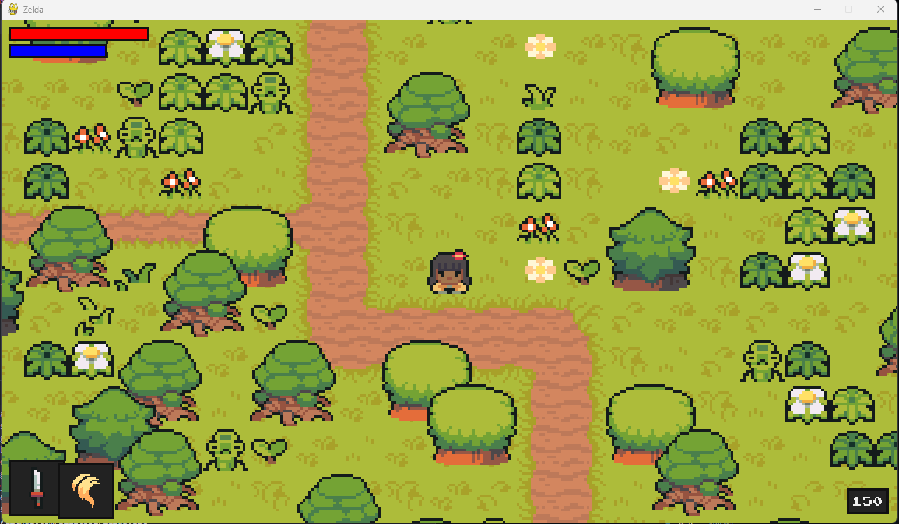

# Zelda-Style RPG in Python

Welcome to my Zelda-style RPG project implemented in Python! This project aims to provide a sophisticated game experience inspired by the classic Legend of Zelda series, incorporating graphics, animations, fake depth, upgrade mechanics, a level map, and much more.

## Features

- **Graphics and Animations**: The game includes visually appealing graphics and smooth animations to enhance the gameplay experience.

- **Battle Enemies**: Engage in turn-based battles with enemies you encounter. Use your combat skills and strategies to defeat them and earn xp.

- **Level Up**: Gain experience points (XP) by defeating enemies and completing quests. Level up to increase your character's stats and become stronger.

## Installation

1. Clone the repository: `git clone https://github.com/your-username/your-repository.git`
2. Install the required dependencies: `pip install -r requirements.txt`

## Usage

1. Navigate to the project directory: `cd your-repository`
2. Run the game: `python main.py`
3. Enjoy playing the Zelda-style RPG!

## Gameplay

- Use the arrow keys to move the character around the game world.
- Interact with objects and characters by pressing the action button.

## Contributing

Contributions to this project are welcome! If you find any bugs or have suggestions for new features, please open an issue or submit a pull request.

## License

This project is licensed under the [MIT License](LICENSE).
